

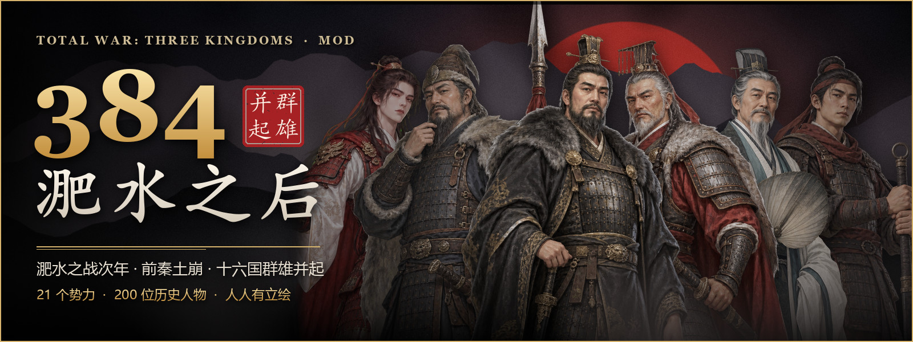

# 384 · 淝水之后

### 《全面战争：三国》十六国剧本 Mod

**淝水之战次年，前秦土崩，群雄并起。** 
慕容垂有兵无都，苻坚困守长安，姚苌坐观成败，谢安、谢玄乘胜北伐； 
这一年拓跋珪十三岁，刘裕还没有投军。

 

<a href="#about">这是什么</a> ·
<a href="#gallery">人物画廊</a> ·
<a href="#screens">游戏内截图</a> ·
<a href="#factions">势力与特色</a> ·
<a href="#territory">疆域</a> ·
<a href="#ranking">人物排名</a> ·
<a href="#events">事件</a> ·
<a href="#armies">军队</a> ·
<a href="#skills">技能与名器</a> ·
<a href="#status">开发状态</a> ·
<a href="#compat">兼容性</a> ·
<a href="#credits">致谢与声明</a>

> [!NOTE]
> **这个 Mod 还在开发中，尚未发布，目前没有下载。** 这一页是它的展示页：做了什么、长什么样、做到哪一步了。

## 🏯 这是什么

- **一个新时代的大战役。** 选剧本界面上原来「291：八王之乱」的位置变成「**淝水之后（384 年）**」。新开一局，世界就是公元 384 年六月的样子：**22 个势力、204 位历史人物、两百多座城逐城按史实归属**。
- **格局像 190 年，但更乱。** 北方权力真空，没有一家能速推：秦是一个四面起火的空架子，燕有二十万众却没有一座像样的都城，晋强而内耗，代、乞伏、铁弗、凉州各据一角。
- **人人有脸，人人有数。** 204 人都有五维和天赋，其中 203 人已有自己的立绘（爨琚的正在画）；最顶尖的 24 位有外号、专属技能树和取自本人事迹的招牌武将技——投鞭断流、风声鹤唳、却月阵、髑髅台。
- **历史会自己走过来。** 吕光 385 年带着西征军和鸠摩罗什东归，拓跋珪 386 年登场接任代王，王镇恶、赫连勃勃、崔浩到岁数才出场，孙恩 399 年在会稽起事。
- **190 年的三国原封不动。** 一切只发生在八王之乱这个剧本里，连名器改名都只在本剧本生效。

## 🎴 人物画廊

200 个登场人物每人一张立绘（全身像，游戏里的人物面板、列表头像、官位卡都用它）。下面是其中十六位。

<table>
<tr>
<td align="center" valign="top" width="25%">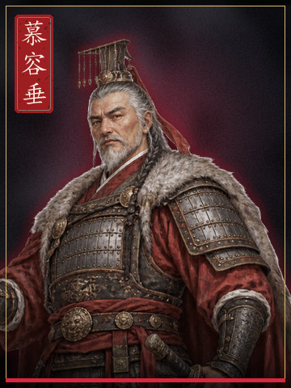 <b>慕容垂</b> · 复燕之主 燕王，58 岁。“自枋头至参合，平生未尝一败。”总榜第一。</td>
<td align="center" valign="top" width="25%">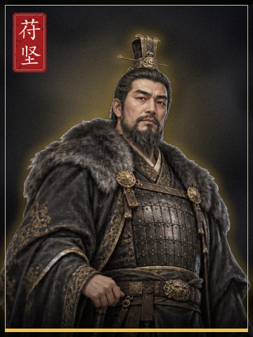 <b>苻坚</b> · 大秦天王 混一北方二十年，淝水一败，困守长安而不肯弃城。</td>
<td align="center" valign="top" width="25%">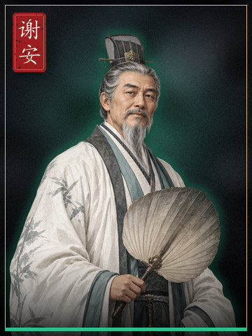 <b>谢安</b> · 东山再起 “小儿辈大破贼。”强敌压境而对弈如常，朝野恃之以安。</td>
<td align="center" valign="top" width="25%">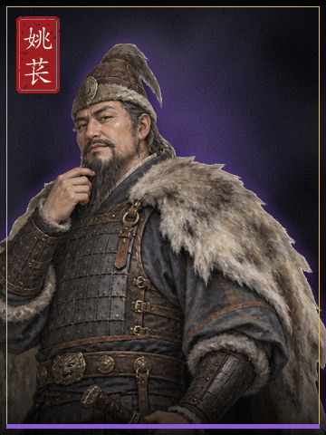 <b>姚苌</b> · 万年秦王 据渭北羌众，坐观苻坚与慕容冲相斗，待其两败。</td>
</tr>
<tr>
<td align="center" valign="top">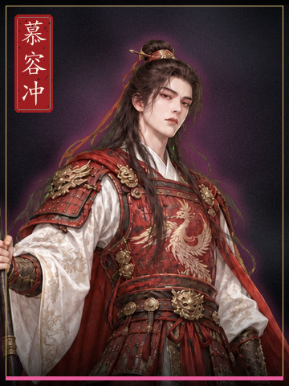 <b>慕容冲</b> · 凤皇 “孤今心在天下，岂顾一袍小惠！”十万鲜卑兵临阿房。</td>
<td align="center" valign="top">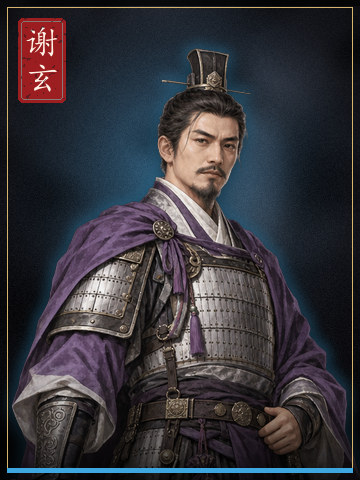 <b>谢玄</b> · 北府之锋 募劲勇于京口，号北府兵；淝水一战，以八万破百万。</td>
<td align="center" valign="top">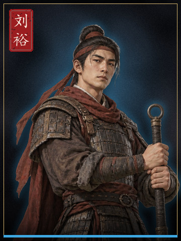 <b>刘裕</b> · 寄奴 21 岁，1 级开局，还只是北府军里的无名之辈。总榜第二。</td>
<td align="center" valign="top">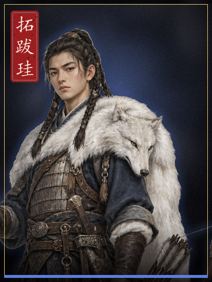 <b>拓跋珪</b> · 代北之主 六岁亡国，十六岁复国。386 年登场，即接任代王。</td>
</tr>
<tr>
<td align="center" valign="top">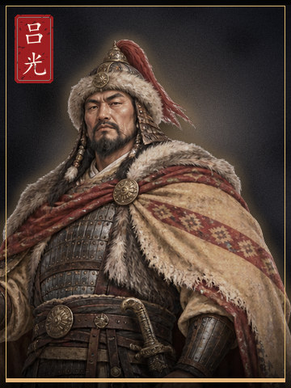 <b>吕光</b> · 西征都督 破龟兹、降三十余国，385 年以驼二万头载西域珍宝东归。</td>
<td align="center" valign="top">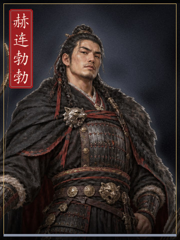 <b>赫连勃勃</b> · 统万之主 397 年登场。美风仪，而凶暴好杀；蒸土筑城，锥入一寸即杀作者。</td>
<td align="center" valign="top">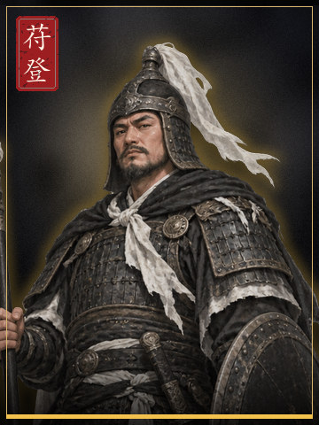 <b>苻登</b> · 死休 将士铠胄皆刻“死休”二字，军中载苻坚神主，每战必告。</td>
<td align="center" valign="top">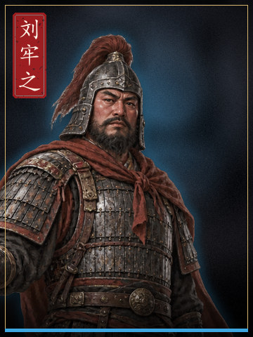 <b>刘牢之</b> · 北府骁将 面紫赤色，须目惊人。洛涧夜渡，五千精兵斩梁成。</td>
</tr>
<tr>
<td align="center" valign="top"> <b>谢道韫</b> · 咏絮之才 “未若柳絮因风起。”开局与王凝之为夫妻——“不意天壤之中乃有王郎！”</td>
<td align="center" valign="top">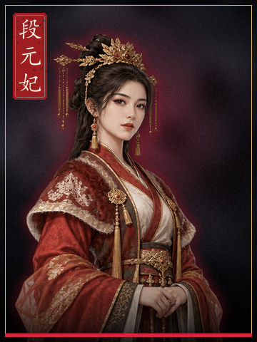 <b>段元妃</b> · 元妃 “我终不作凡人妻。”慕容垂继室，尝谏太子宝不堪大任。</td>
<td align="center" valign="top">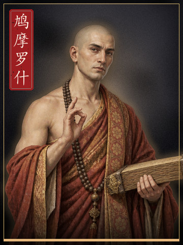 <b>鸠摩罗什</b> · 道震西域 吕光破龟兹得之，385 年随西征军入场。</td>
<td align="center" valign="top"> <b>桓玄</b> · 灵宝 385 年登场。桓温的幼子，觉得天下本该是桓家的。</td>
</tr>
</table>

立绘为 AI 生成：每人一段按史料写的提示词（年龄、族属、冠服、兵器、事迹），出图后逐张核对。详见<a href="#credits">致谢与声明</a>。

## 📸 游戏内截图

开发版本里的实机画面（分别以燕王慕容垂、大秦天王苻坚开局，都是第 1 回合）。

<table>
<tr>
<td width="50%">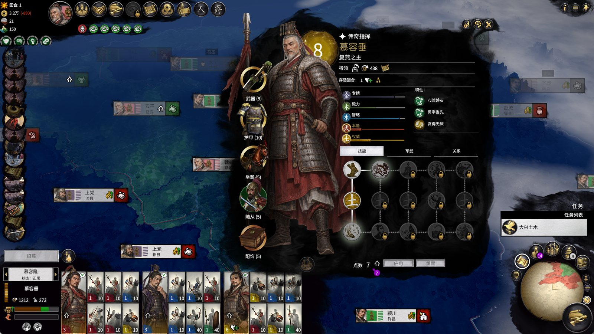 <b>慕容垂 · 复燕之主</b>——8 级开局，专属立绘、外号、五维和技能树。</td>
<td width="50%">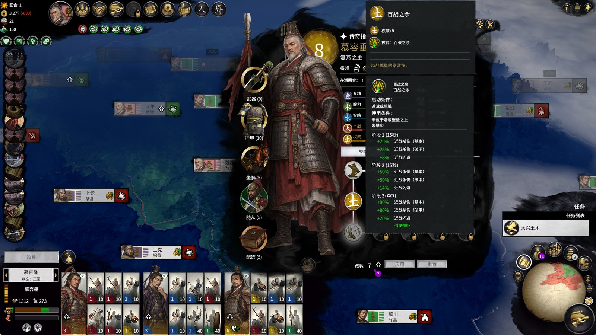 招牌被动<b>「百战之余」</b>：越战越勇，三十秒到顶，近战杀伤 +80%。</td>
</tr>
<tr>
<td>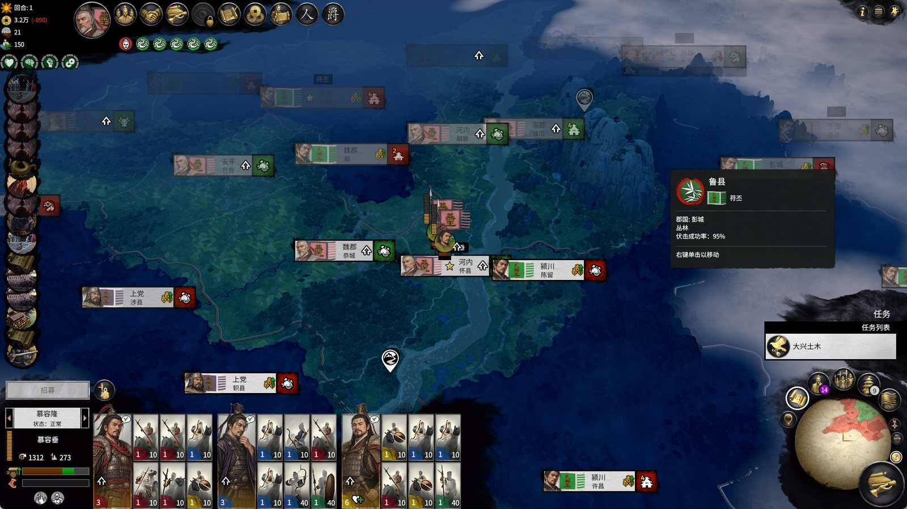 <b>三将一军</b>：慕容隆这支军里三员将领各带自己的六队——鲜卑掠骑兵、铁骑、鲜卑马弓手。</td>
<td>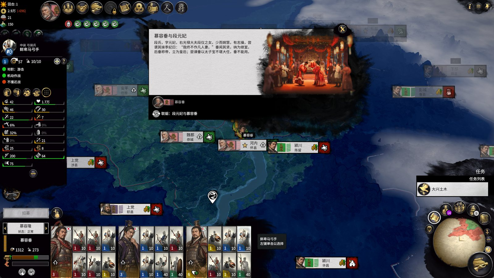 开局事件<b>「慕容垂与段元妃」</b>：史实上的夫妻开局即成婚；左侧是鲜卑马弓手的兵牌。</td>
</tr>
<tr>
<td>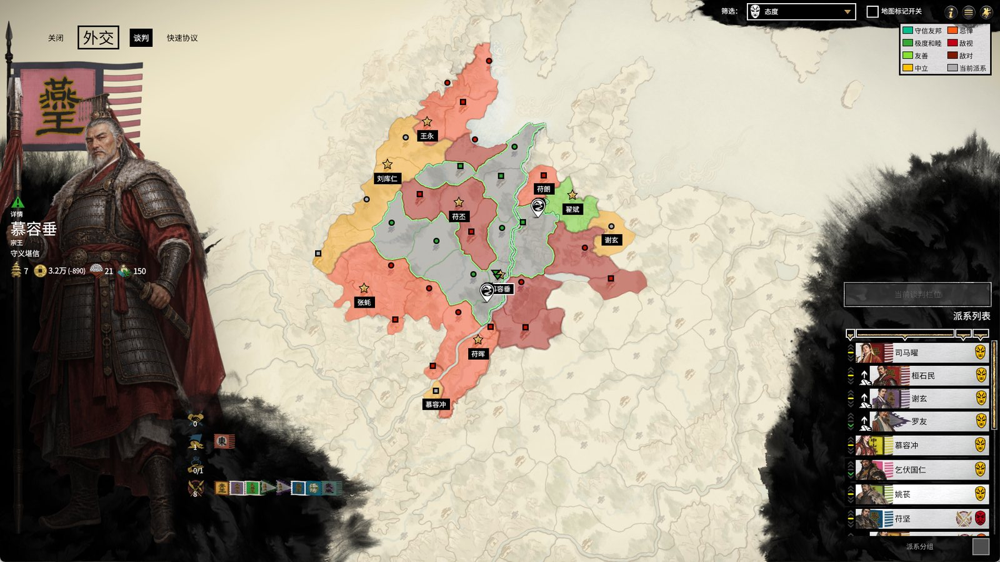 燕王眼里的天下：邺城里的苻丕、洛阳的苻晖、背后的丁零翟斌、东边的谢玄——<b>四面皆敌</b>。</td>
<td>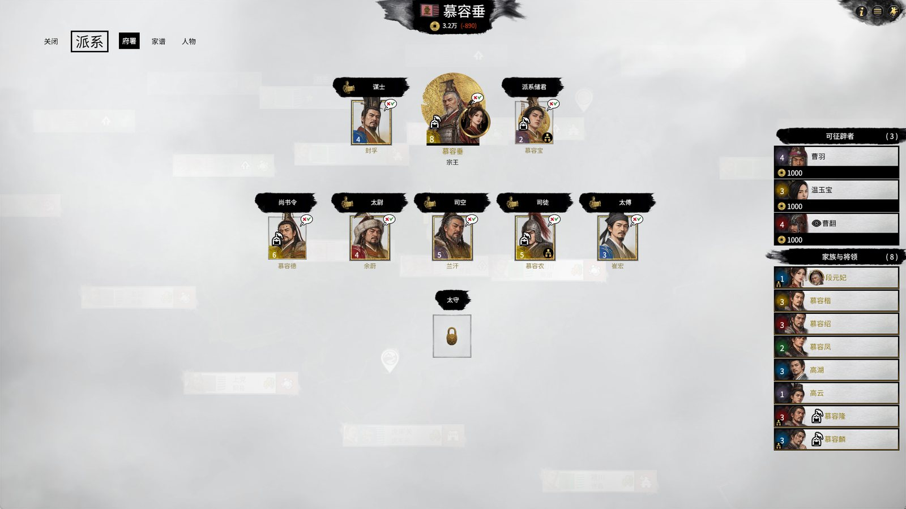 燕的<b>府署</b>：慕容德、慕容农、封孚、余蔚、兰汗、崔宏开局各就其位；储君慕容宝。</td>
</tr>
<tr>
<td>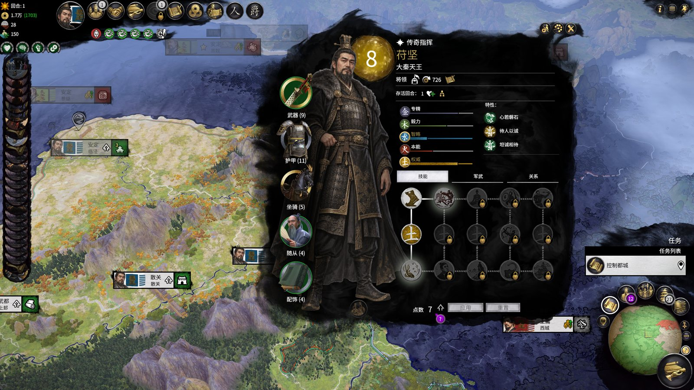 换一家：<b>苻坚 · 大秦天王</b>，同样 8 级开局，困守长安。</td>
<td>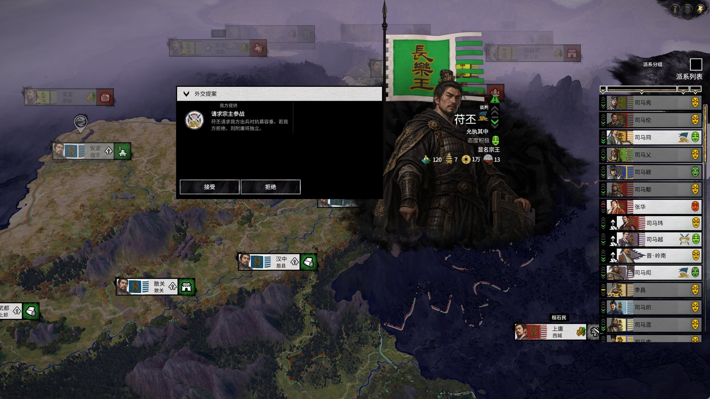 秦的第一回合：邺城里的<b>长乐公苻丕</b>打着“长乐王”旗来<b>请求宗主参战</b>，对抗慕容垂——不救，附庸就独立。</td>
</tr>
<tr>
<td>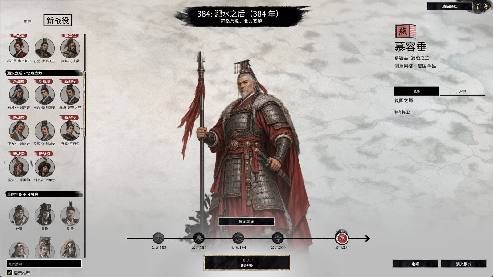 <b>选派系界面</b>：「淝水之后 · 384 年的势力」单独一组，十二家可选，头像下是“姓名·外号”。</td>
<td>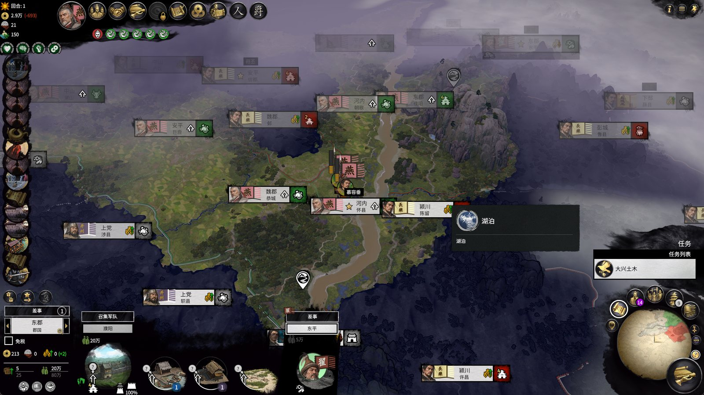 战役地图上的<b>字旗</b>：慕容垂的「燕」、邺城一线苻丕的「長樂」。</td>
</tr>
<tr>
<td>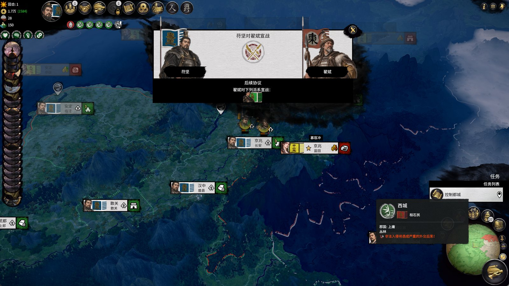 <b>苻坚对翟斌宣战</b>：幽州的王永也来求援，宗主只好向丁零宣战。外交事件里用的都是各人自己的立绘。</td>
<td>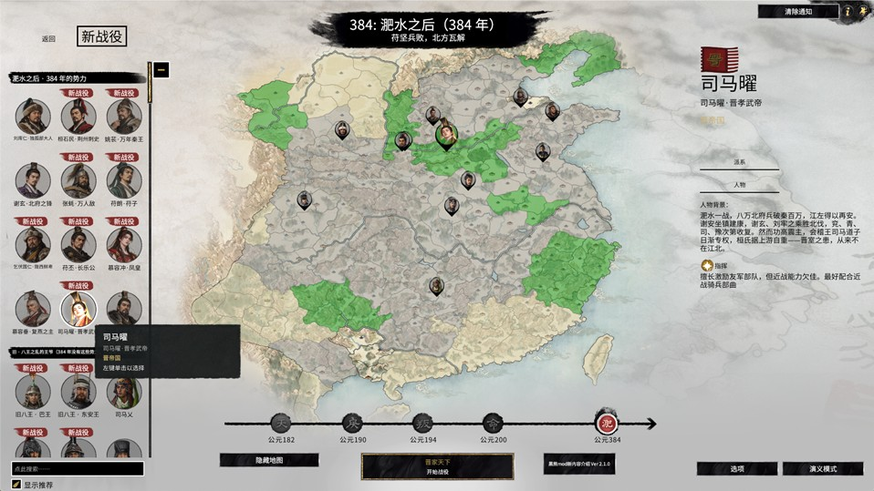 自己的<b>开局存档</b>：选剧本界面是「公元 384」，列表头像、地图图钉、右上角的名字都是 384 年的君主和我们画的立绘。</td>
</tr>
<tr>
<td>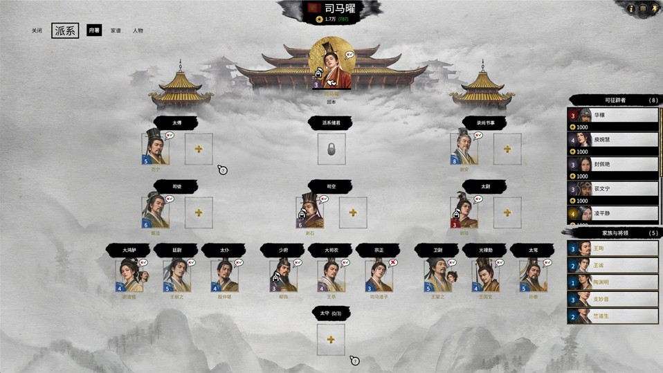 晋一开局就是<b>三公九卿</b>的皇宫府署（这张是按等级自动补满时的样子；现在按史实只封史书载明 384 年在任的四人：录尚书事谢安、司徒司马道子、尚书令谢石、中书令王献之，其余由玩家自己封）。</td>
<td>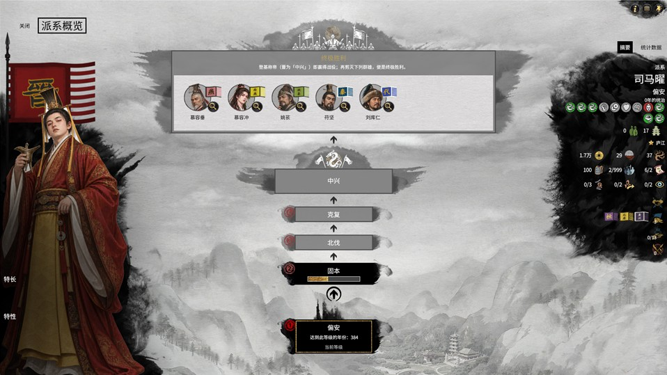 晋自己的<b>等级阶梯</b>：偏安 → 固本 → 北伐 → 克复 → 中兴；终极胜利要剪灭的是 384 年的几大强权（活着的显示君主立绘）。</td>
</tr>
</table>

## ⚔️ 势力与特色

开局 20 家在图上，凉·吕氏 385 年入场，孙恩 399 年起事。每家一个**永久**的派系特色，有利有弊，取自史实。下面是其中十二家，**全部 22 家和选派系界面的简介见 [docs/factions.md](docs/factions.md)**。

| 势力 | 君主 | 都城 | 特色 | 好处 | 代价 |
|---|---|---|---|---|---|
| **秦** | 苻坚 | 长安 | **天王余威，土崩之势** | 研究速率 +10%；纳贡收入 +30%；人物满意度 +3 | 民心 −6；补员 −5% |
| **秦·关东** | 苻丕 | 邺 | **孤城** | 全军士气 +3；军需 +5 | 补员 −8%；产值 −10% |
| **燕** | 慕容垂 | 怀县 | **复国之师** | 补员 +8%；征募费用 −15%；全军士气 +3 | 产值 −10% |
| **西燕** | 慕容冲 | 弘农 | **鲜卑东归** | 战役移动范围 +15%；近战杀伤 +5% | 民心 −10；粮食产量 −15% |
| **后秦** | 姚苌 | 三水 | **渭北羌众** | 补员 +5%；征募费用 −10%；军需 +5 | 研究速率 −10% |
| **晋** | 司马曜 | 建康 | **江左门阀** | 商业产值 +15%；研究速率 +10%；与所有派系的关系 +5 | 腐败 +10%；征募费用 +15% |
| **晋·北府** | 谢玄 | 淮阴 | **北府兵** | 新募部队等级 +2；近战杀伤 +5%；全军士气 +2 | 部曲维持费 +10% |
| **晋·荆州桓氏** | 桓石民 | 江陵 | **上游重镇** | 补员 +5%；农业产值 +10%；人物满意度 +2 | 与所有派系的关系 −5 |
| **代** | 刘库仁（摄政） | 阴馆 | **代北铁骑** | 冲锋加成 +10%；战役移动范围 +15% | 研究速率 −15%；商业产值 −15% |
| **乞伏** | 乞伏国仁 | 金城 | **陇西鲜卑** | 补员 +5%；战役移动范围 +10% | 研究速率 −10%；商业产值 −10% |
| **凉·吕氏** | 吕光 | 休屠（385 年） | **西征之师** | 每季部队经验 +2；战役移动范围 +10%；全军士气 +3 | 民心 −8；部曲维持费 +10% |
| **孙恩** | 孙恩 | 临海（399 年） | **长生人** | 征募费用 −40%；补员 +10%；全军士气 +4 | 产值 −20%；与所有派系的关系 −20 |

其余十家：秦·并州「表里山河」、秦·幽州「悬军幽蓟」、秦·平州「龙城旧都」、秦·青州「青齐观望」、秦·洛阳「四战之地」、秦·凉州「河西殷富」、丁零「丁零流寇」、晋·岭南「岭表」、晋·宁州爨氏「南中大姓」、铁弗「朔方游骑」。

**势（攒点发动的主动能力）**：选派系界面上的 20 家（12 家主要势力 + 8 家地方势力）各有一种“势”和三个能力，入口是左上角派系栏里的「势」按钮。开局 6 点、上限 60，每回合 +1，其余按各家处境攒；每个能力是一个持续几回合的派系效果，生效期间不能重复发动。只给玩家自己的势力。

| 势力 | 势 | 怎么多攒 | 三个能力 |
|---|---|---|---|
| 秦 | 天王余威 | 据长安，打胜仗 | 天王亲征 · 开仓赈民 · 征发关中 |
| 燕 | 复国之志 | 取城，打胜仗 | 复国号召 · 鲜卑铁骑 · 安抚河北 |
| 晋 | 中兴之望 | 据洛阳，取城，打胜仗 | 北伐诏令 · 清议选士 · 土断整籍 |
| 晋·北府 | 北府军威 | 据广陵，取城，打胜仗 | 京口募勇 · 洛涧夜渡 · 屯田淮南 |
| 晋·荆州桓氏 | 上游之势 | 据江陵、襄阳，打胜仗 | 荆楚劲旅 · 舟师顺流 · 桓氏门生 |
| 后秦 | 羌豪归附 | 取城，打胜仗 | 万年秦王 · 坐观成败 · 羌骑突击 |
| 西燕 | 东归之心 | 取城，打胜仗 | 凤皇之怒 · 十万鲜卑 · 就食关中 |
| 代 | 代北部众 | 据雁门，打胜仗 | 代北骑射 · 部落征发 · 马市互市 |
| 乞伏 | 陇西部众 | 取城，打胜仗 | 勇士川 · 陇西骑兵 · 招抚羌胡 |
| 秦·关东 | 孤城死守 | 据邺，打胜仗 | 以松喂马 · 邺城死守 · 征发关东 |
| 秦·并州 | 表里山河 | 据晋阳，打胜仗 | 万人敌 · 晋阳积粟 · 太行募兵 |
| 秦·青州 | 清谈之风 | 据广固，打胜仗 | 苻子著书 · 海盐之利 · 举州观望 |
| 秦·凉州 | 河西之固 | 据姑臧，打胜仗 | 凉州大马 · 闭境拒守 · 河西殷富 |
| 秦·洛阳 | 天下之中 | 据洛阳，取城，打胜仗 | 率众西归 · 平原公亲军 · 中州漕运 |
| 秦·幽州 | 幽燕孤忠 | 据蓟，打胜仗 | 猛之遗风 · 幽州突骑 · 北拒燕军 |
| 秦·平州 | 辽海之险 | 据阳乐，打胜仗 | 龙城坚守 · 征发辽西 · 辽东互市 |
| 丁零 | 丁零之众 | 取城，打胜仗 | 聚众为军 · 流寇剽掠 · 丁零死士 |
| 铁弗 | 河西杂类 | 据河阴，取城，打胜仗 | 寇抄 · 西单于 · 匈奴铁骑 |
| 晋·岭南 | 岭表之富 | 据番禺，打胜仗 | 南海珍异 · 讨伐林邑 · 抚绥俚獠 |
| 晋·宁州爨氏 | 南中之望 | 据味县，打胜仗 | 诸姓部曲 · 南中劲卒 · 夷帅会盟 |

**所有 384 势力共有**——淝水之后各家多是“因粮于敌”的流动军团，不靠府库养兵：

- **乱世军制**（永久）：部曲维持费 −20%，人物俸禄 −20%。
- **就食于敌**（开局 25 回合）：维持费再 −20%。打下根基之后，就得靠自己的钱粮养兵了。
- **群雄思奋**（开局 25 回合）：人物满意度 +20——只给开局人多官少的秦、燕、晋、晋·北府、晋·荆州桓氏、代。
- **旬日之间，众至二十万**（开局 10 回合，只有燕）：维持费再 −30%——起兵之初四面皆敌，来投的各部自备鞍马粮械。

**字旗**：每家一面 384 年的旗——没有称王的用州名、姓氏或军号：谢玄打「北府」，桓氏打「桓」，姚苌「姚秦」，慕容冲「西燕」，吕光「呂」，孙恩「長生」，各镇刺史打州名。颜色跟地图上的势力色走。

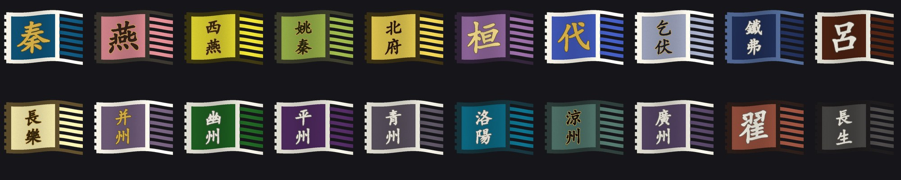

**外交**：秦的关东、并州、幽州、平州、青州、洛阳、凉州七镇“仍奉秦朔”，开局是秦的附庸；北府、荆州桓氏、岭南、宁州是晋的附庸；丁零是燕的附庸。开局即交战的有六组：燕 ⚔ 秦·关东（围邺）、西燕 ⚔ 秦、后秦 ⚔ 秦、晋·北府 ⚔ 秦·青州、晋·北府 ⚔ 秦·洛阳、晋·荆州桓氏 ⚔ 秦。

## 🗺️ 疆域

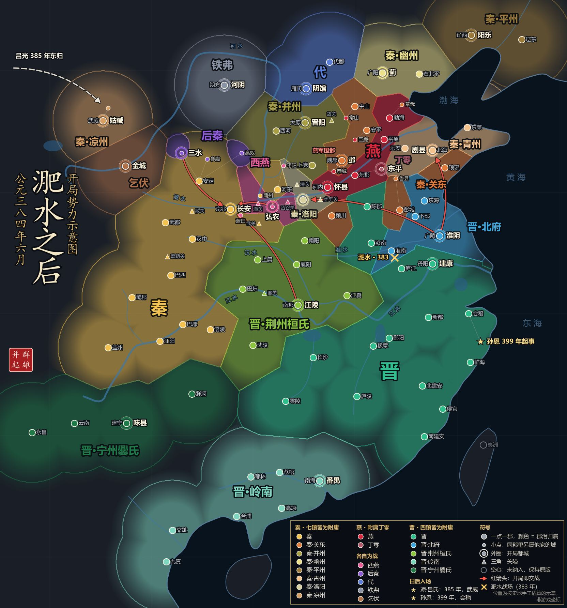

示意图：一点一郡（游戏地图共 84 郡），颜色 = 郡治归属，小点 = 同郡里另属他家的城。位置按史地手工估算，不是游戏坐标；点开可看大图。

归属**精确到城**：邺是苻丕死守的孤城，城外的恭城是慕容垂的；长安归苻坚，城外的蓝田归慕容冲；姚苌在渭北的三水。**逐城清单和逐郡依据见 [docs/territory.md](docs/territory.md)**。

| 势力 | 郡 / 城 | 核心地域 |
|---|:---:|---|
| **秦** | 14 / 30 | 长安、河东、安定郡城，加上武都、汉中与整个巴蜀 |
| **秦·关东** | 6 / 11 | 邺、信都、卢奴三座孤城，外加彭城、琅琊、颍川 |
| **秦·并州** | 4 / 9 | 太原（晋阳）、上党、西河、故关 |
| **秦·幽州** | 2 / 4 | 广阳（蓟）、右北平 |
| **秦·平州** | 2 / 4 | 辽西（和龙）、辽东 |
| **秦·青州** | 3 / 7 | 乐安、北海（广固）、东莱 |
| **秦·洛阳** | 3 / 3 | 洛阳、虎牢关、濝关 |
| **秦·凉州** | 1 / 3 | 武威（姑臧） |
| **燕** | 4 / 9 | 河内、东郡、平原、勃海，以及邺、信都、卢奴的城外 |
| **丁零** | 0 / 1 | 东郡的东平一城 |
| **西燕** | 2 / 5 | 潼关、函谷关，弘农、蓝田、平阳 |
| **后秦** | 0 / 3 | 安定北部的三水、参䜌、高奴（折算北地） |
| **晋** | 15 / 45 | 扬州、江州、湘州与豫州南部 |
| **晋·北府** | 4 / 11 | 广陵、淮南（寿春）、下邳、东海 |
| **晋·荆州桓氏** | 8 / 19 | 南郡（江陵）、襄阳、南阳、江夏、上庸、武陵、巴东、夔关 |
| **晋·岭南** | 7 / 22 | 南海、苍梧、郁林、合浦、高凉、交趾、九真 |
| **晋·宁州爨氏** | 4 / 12 | 建宁、牂牁、云南、永昌（南中） |
| **代** | 2 / 4 | 雁门、代郡 |
| **铁弗** | 1 / 4 | 朔方 |
| **乞伏** | 1 / 3 | 金城 |

“郡 / 城”= 郡治在手的郡数 / 城池总数。夷洲不动，保持原版。南中四郡名义属晋、实权在爨氏，单独成「晋·宁州爨氏」，由爨家当家。

## 🏆 人物排名（前 20）

开局时大家年龄、等级都不一样，没法比，所以排的是 **9 级估值**：先天五维（职业基础值 + 个人天赋加成）+ 到 9 级为止技能点点出来的五维，不算装备、性格和随从。**200 人的完整排名见 [docs/characters.md](docs/characters.md)**。

| # | 人物 | 势力 | 定位 | 开局 | 专精 | 毅力 | 智略 | 本能 | 权威 | 合计 |
|---:|---|---|---|---|---:|---:|---:|---:|---:|---:|
| 1 | **慕容垂** · 复燕之主 | 燕 | 统帅 | 8 级 | 70 | 53 | 65 | 95 | 156 | **439** |
| 2 | **刘裕** · 寄奴 | 晋·北府 | 统帅 | 1 级 | 55 | 53 | 60 | 65 | 156 | **389** |
| 3 | **檀道济** · 万里长城 | 晋·北府 | 统帅 | 1 级，385 年登场 | 65 | 53 | 65 | 35 | 151 | **369** |
| 4 | **谢安** · 东山再起 | 晋 | 军师 | 8 级 | 35 | 60 | 178 | 40 | 55 | **368** |
| 5 | **谢玄** · 北府之锋 | 晋·北府 | 统帅 | 7 级 | 65 | 38 | 55 | 50 | 151 | **359** |
| 6 | **赫连勃勃** · 统万之主 | 铁弗 | 统帅 | 1 级，397 年登场 | 45 | 38 | 55 | 65 | 151 | **354** |
| 7 | **刘穆之** · 决断如流 | 晋·北府 | 军师 | 2 级 | 55 | 45 | 183 | 40 | 30 | **353** |
| 8 | **崔浩** · 算无遗策 | 燕 | 军师 | 1 级，397 年登场 | 45 | 45 | 193 | 40 | 30 | **353** |
| 9 | **张蚝** · 万人敌 | 秦·并州 | 勇士 | 7 级 | 30 | 137 | 35 | 110 | 40 | **352** |
| 10 | **桓石虔** · 镇恶郎 | 晋·荆州桓氏 | 勇士 | 6 级 | 30 | 142 | 35 | 105 | 40 | **352** |
| 11 | **苻登** · 死休 | 秦 | 先锋 | 5 级 | 40 | 65 | 38 | 160 | 45 | **348** |
| 12 | **桓玄** · 灵宝 | 晋·荆州桓氏 | 军师 | 1 级，385 年登场 | 35 | 45 | 168 | 50 | 50 | **348** |
| 13 | **王镇恶** · 王猛之孙 | 秦 | 军师 | 1 级，389 年登场 | 35 | 65 | 178 | 40 | 30 | **348** |
| 14 | **刘牢之** · 北府骁将 | 晋·北府 | 勇士 | 5 级 | 30 | 142 | 35 | 100 | 40 | **347** |
| 15 | **吕光** · 西征都督 | 凉·吕氏 | 统帅 | 7 级 | 65 | 38 | 40 | 50 | 151 | **344** |
| 16 | **慕容德** · 范阳王 | 燕 | 统帅 | 6 级 | 45 | 53 | 60 | 35 | 151 | **344** |
| 17 | **拓跋珪** · 代北之主 | 代 | 统帅 | 2 级，386 年登场 | 45 | 38 | 55 | 55 | 151 | **344** |
| 18 | **沮渠蒙逊** · 卢水雄杰 | 秦·凉州 | 军师 | 1 级 | 35 | 45 | 178 | 40 | 45 | **343** |
| 19 | **苻坚** · 大秦天王 | 秦 | 统帅 | 8 级 | 45 | 53 | 50 | 35 | 156 | **339** |
| 20 | **慕容农** · 辽西王 | 燕 | 统帅 | 5 级 | 60 | 38 | 40 | 55 | 146 | **339** |

<b>各项前十</b>（权威 / 智略 / 本能 / 毅力 / 专精）

- **统帅（权威）**：苻坚 156、慕容垂 156、刘裕 156、吕光 151、慕容德 151、谢玄 151、拓跋珪 151、赫连勃勃 151、檀道济 151、慕容农 146
- **军师（智略）**：崔浩 193、刘穆之 183、谢安 178、王镇恶 178、沮渠蒙逊 178、姚苌 173、桓玄 168、张衮 162、苻朗 159、尹纬 159
- **武力（本能）**：苻登 160、慕容冲 160、沈田子 151、吕纂 148、长孙肥 148、何无忌 148、杜进 145、慕容隆 145、谢琰 145、冯该 145
- **坚韧（毅力）**：刘牢之 142、桓石虔 142、张蚝 137、穆崇 137、杨定 131、慕容凤 131、杨佺期 131、桓振 131、拓跋虔 131、苻琳 122
- **技艺（专精）**：毛兴 130、索泮 130、姚绪 130、孙无终 130、郗恢 130、桓石民 130、杨亮 130、叔孙建 130、诸葛侃 130、高衡 130

名单里不只有帝王将相：谢道韫、苏蕙、毛氏、贺氏、支妙音等女性，释道安、鸠摩罗什、慧远、法显、竺道生、寇谦之等僧道，陶渊明、顾恺之、王献之、戴逵也都在；昏君庸才有自己的负面天赋——慕容宝「参合之败」、司马德宗「口不能言」、王凝之「五斗米道」。

## 📜 事件与时间线

三国全战一年 5 个回合：第 1 回合 = 384 年夏，第 6 回合 = 385 年，第 76 回合 = 399 年。

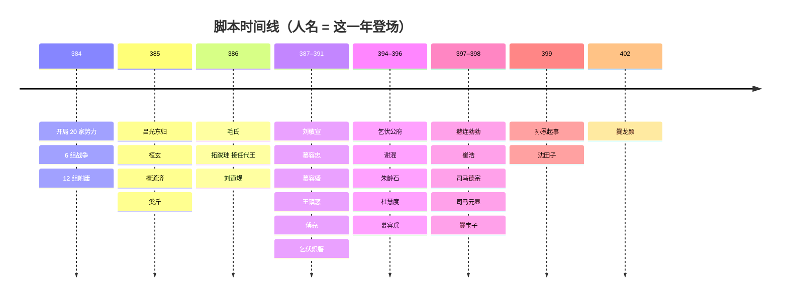
```mermaid
timeline
    title 脚本时间线（人名 = 这一年登场）
    384 : 开局 20 家势力 : 6 组战争 : 12 组附庸
    385 : 吕光东归 : 桓玄 : 檀道济 : 奚斤
    386 : 毛氏 : 拓跋珪 接任代王 : 刘道规
    387–391 : 刘敬宣 : 慕容忠 : 慕容盛 : 王镇恶 : 傅亮 : 乞伏炽磐
    394–396 : 乞伏公府 : 谢混 : 朱龄石 : 杜慧度 : 慕容瑶
    397–398 : 赫连勃勃 : 崔浩 : 司马德宗 : 司马元显 : 爨宝子
    399 : 孙恩起事 : 沈田子
    402 : 爨龙颜
```

| 回合 | 年份 | 事件 |
|---:|---|---|
| 1 | 384 | 脚本把世界改成 384 年：换人、逐城换主、各家带兵出场、封官、附庸与战争就位；天子令牌交还建康，原版的贾后 / 八王剧情全部摘掉。开局抉择改写为「淝水之后，何去何从」 |
| 6 | 385 | **吕光东归**：凉·吕氏带着吕光、鸠摩罗什等 8 人出现在武威，立即与秦·凉州开战。桓玄、檀道济登场 |
| 11 | 386 | **拓跋珪登场并接任代王**；毛氏登场，与苻登成婚 |
| 26 | 389 | 王镇恶（王猛之孙）登场——史实上的本家秦若已灭亡，改投晋·北府 |
| 66 | 397 | 赫连勃勃、崔浩登场 |
| 76 | 399 | **孙恩起事**：孙恩、卢循、徐道覆随“长生人”一起出现在临海（此前地图上没有他们），向晋、晋·北府、晋·荆州桓氏宣战 |

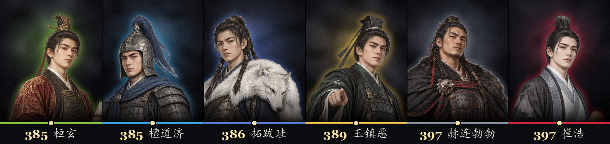

384 年年纪还小（或史实上更晚才出场）的 24 个人到年份才登场，从低级练起；本家亡了会改投别家。史实上的夫妻开局即成婚：**慕容垂 + 段元妃**、**苻坚 + 张夫人**、**王凝之 + 谢道韫**；**苻登 + 毛氏**这一对要等毛氏 386 年登场时再办。**全部登场名单、回合表和史实对照见 [docs/events.md](docs/events.md)**。

## 🐎 军队

开局每员带兵的将领都有**自己的部曲**（最多 6 队），**三员将领一军**。兵种按“文化 × 职业”配：前 4 队是本职业能募的兵（战损了补得上），后 2 队是这个文化的特色兵；铁骑、鲜卑掠骑兵、鲜卑马弓手、匈奴骑兵、宿卫刀骑兵这些年代正合适的兵种来自八王之乱 DLC。

| 军制 | 谁用 | 特色兵种 |
|---|---|---|
| **鲜卑铁骑** | 燕、西燕、代、乞伏 | 铁骑（甲骑具装）、鲜卑掠骑兵、鲜卑马弓手 |
| **匈奴骑兵** | 铁弗 | 匈奴骑兵、匈奴铁骑、重装骑射手 |
| **氐秦重步兵** | 秦与关东、并、幽、平、青、洛阳诸镇，凉·吕氏 | 重装戟步兵、重装持矛亲卫、重装弩兵、铁骑 |
| **羌骑** | 后秦 | 羌族掠袭骑兵、羌族劫匪、羌族猎手 |
| **晋州郡兵** | 晋、晋·荆州桓氏、晋·岭南、晋·宁州爨氏 | 步兵与弓弩为主，骑兵少；持刀宿卫、连弩兵 |
| **北府兵** | 晋·北府 | 宿卫刀骑兵、佩剑守卫、重装戟步兵、重装连弩兵 |
| **凉州步骑** | 秦·凉州 | 西凉骑兵、骑乘弓箭手，“凉州大马，横行天下” |
| **流寇** | 丁零、孙恩 | 民兵、农民战团、农民游骑——聚则为军，散则为盗 |

规模按史实的声势来：秦、燕各 6 员带兵将领，西燕、晋、晋·北府、晋·荆州桓氏各 5 员，后秦、秦·关东各 4 员，其余小镇 2～3 员。

## ✨ 招牌技能、天赋与名器

第一波 24 位名人每人一个**开局自带的被动**（AI 手里的名人一登场就有）和一个**主动技**，名字和效果都取自本人的事迹。主动技讲究“按下去就发生一件事”：一刀、一把火、钉死一支敌军、全军当场回气。

<table>
<tr><th>人物</th><th>被动（开局自带）</th><th>主动</th></tr>
<tr><td nowrap><b>苻坚</b></td><td><b>混一六合</b>：60 米内友军士气 +12、近战闪避 +10、伤害减免 +10%</td><td><b>投鞭断流</b>：“投鞭于江，足断其流。”55 米内敌军 14 秒士气 −25、速度 −20%、冲锋加成减半</td></tr>
<tr><td nowrap><b>慕容垂</b></td><td><b>百战之余</b>：越战越勇，30 秒到顶——近战伤害 +80%、近战闪避 +20，令敌胆寒</td><td><b>枋头逆击</b>：对面前的敌人打出一记溅射重击，被击中者近战闪避 −30、士气 −12</td></tr>
<tr><td nowrap><b>谢安</b></td><td><b>镇之以静</b>：80 米内友军士气 +15，不受恐惧与惊骇影响</td><td><b>风声鹤唳</b>：“皆以为王师已至。”70 米内敌军 12 秒士气 −35、攻速 −20</td></tr>
<tr><td nowrap><b>刘裕</b></td><td><b>气吞万里如虎</b>：越战越勇，到顶后近战伤害 +100%、一击横扫两倍宽、不溃</td><td><b>却月阵</b>：大弩、断槊齐发，45 米内每支敌军 8 秒里每秒约 4% 的士兵被射倒</td></tr>
<tr><td nowrap><b>慕容冲</b></td><td><b>凤皇</b>：移动与冲锋速度 +20%，冲锋加成 +80%，近战伤害 +25%</td><td><b>阿房之火</b>：“烟尘蔽天。”40 米内每支敌军 8 秒里持续被烈焰吞没</td></tr>
<tr><td nowrap><b>张蚝</b></td><td><b>万人敌</b>：越战越勇，到顶后近战伤害 +120%，撞不动，令敌惊骇</td><td><b>曳牛却走</b>：点选一支敌军，硬生生拖住——10 秒内一步也动不了</td></tr>
<tr><td nowrap><b>赫连勃勃</b></td><td><b>凶暴好杀</b>：近战伤害 +50%、攻速 +20，令周围敌军惊骇</td><td><b>髑髅台</b>：积人头为京观。45 米内敌军 12 秒士气 −35，前 6 秒持续减员</td></tr>
<tr><td nowrap><b>檀道济</b></td><td><b>万里长城</b>：50 米内友军近战闪避 +20、盾牌格挡 +20、抗冲击 ×2</td><td><b>唱筹量沙</b>：粮尽而夜唱筹量沙。60 米内敌军 15 秒不能奔跑、攻速 −30、冲锋加成减半</td></tr>
</table>

每人另有一个战役层面的**天赋**：谢安「镇之以静」当君主或丞相时全派系人物满意度 +15、腐败 −15%；崔浩「神机」研究速率 +30%；刘穆之「内总朝政」腐败 −20%、建筑维持费 −15%；王镇恶「直取长安」所在军队移动范围 +20%、围城效率 +50%。

**名器**借用原版名器的模型和图标，只在本剧本里改名，190 年的方天画戟、赤兔原样不动：

| 名器 | 主人 | 出处 |
|---|---|---|
| **金刀** | 慕容垂 | 少时所佩。王猛伐燕，使人盗此刀为信以诳其子慕容令，世称“金刀计” |
| **天王剑** | 苻坚 | 坚不称帝，终身称天王 |
| **大夏龙雀** | 赫连勃勃 | 所造百炼钢刀，背有铭文：“大夏龙雀，名冠神都……如风靡草，威服九区” |
| **寄奴刀** | 刘裕 | 微时所用。尝独驱数千人，“手奋长刀，所杀伤甚众” |
| **死休鉾** | 苻登 | “将士皆刻鉾铠为‘死休’字，示以战死为志” |
| **凤皇矛** | 慕容冲 | “凤皇凤皇止阿房” |
| **曳牛锤** | 张蚝 | “多力趫捷，能曳牛却走，城无高下皆可超越” |
| **赭白** | 慕容垂 | 慕容氏世传名马。慕容廆有骏马曰赭白，年四十九而骏逸不亏 |
| **大宛千里驹** | 苻坚 | 大宛所献天马，“皆汗血、朱鬣、五色、凤膺、麟身” |
| **龟兹天马** | 吕光 | 平西域，“骏马万余匹”东归 |

## 🚧 开发状态

**开发中，尚未发布。** 内部版本 0.9.x，大部分内容已经在真游戏里逐轮验证过。

| | 内容 |
|---|---|
| ✅ 已完成 | 22 个势力，逐城疆域，12 组附庸与 6 组开局战争 |
| ✅ 已完成 | 204 位历史人物的五维、天赋、外号，**203 张立绘**（爨琚的在画） |
| ✅ 已完成 | 第一波 24 位名人的专属技能树与招牌武将技 |
| ✅ 已完成 | 22 个派系特色、开局军资与军费平衡、开局封官 |
| ✅ 已完成 | 吕光 385 年入场、孙恩 399 年起事、22 人按年登场 |
| ✅ 已完成 | 17 个按族群与地域划分的随机姓名库（慕容、氐、羌、拓跋、河北、关中、江左……） |
| ✅ 已完成 | 名人装备与 10 件名器改名；八王之乱的旧人物清场；选派系界面单独分组；20 面 384 年的字旗 |
| ✅ 已完成 | 将领自带部曲、三将一军；史实夫妻开局成婚；按游戏实测的每回合亏空补偿开局金钱（均已在游戏内验证） |
| ✅ 已完成 | 自己的开局存档：年份就是 384，选派系界面的名字和头像是 384 年的君主，每个势力有自己的胜利条件 |
| ✅ 已完成 | 等级阶梯改名（侯 → 公 → 王 → 天王 → 皇帝，称帝即胜利；晋：偏安 → 固本 → 北伐 → 克复 → 中兴）；天子令牌收回 |
| ✅ 已完成 | 按政权性质起的官名（北方诸国、部族、都督府、天师道各一套）；晋开局即三公九卿，按史实只封四人（录尚书事谢安、司徒司马道子、尚书令谢石、中书令王献之） |
| ✅ 已完成 | 开场动画与开局加载图换成 384 年的；开局不给城池“残破”（只有史书明载被屠的城才会，384 年没有），富庶的城有加成 |
| ✅ 已完成 | 各势力的府署随等级加官（侯 4 位 → 公 6 位 → 王 10 位 → 天王 11 位 → 皇帝 14 位，三公称帝才有）；开场动画每张配一首诗 |
| ✅ 已完成 | 12 家可选势力各有一套“势”：攒点发动的三个主动能力；选派系界面只有 384 年的 12 家（八王之乱原来的王爷不再出现） |
| 🔧 进行中 | 叛军按地域分为五斗米道与流民坞帅（数据已改，还没在游戏里碰上叛乱验证） |
| 🔧 进行中 | 数值与经济平衡 |
| 📝 还没做 | 其余 180 人的专属技能树和武将技（目前用本职业的技能树） |
| 📝 还没做 | 打包发布（立绘多，包体约 770 MB；发布方式未定） |

## 🧩 兼容性与已知限制

- **需要《八王之乱》DLC。** 剧本做在八王之乱的战役上：借用它现成的“秦王”“燕王”“代王”等派系，带一份自己的开局存档（以游戏本体的为底：年份、谁能选、君主名字、胜利条件、晋的政体），新开局第 1 回合再由脚本布置人物和地盘。
- **启用时占用「291：八王之乱」的位置**，选剧本界面上显示为「淝水之后（384 年）」。**190 年等其他剧本完全不受影响。**
- **不依赖其他 Mod。** 只勾选这一个包实测过：可选的 20 家在选派系界面分两组——「淝水之后 · 主要势力」12 家、「淝水之后 · 地方势力」8 家，头像是我们画的立绘，开局、布置、封官都正常；和派系解锁类 Mod 一起开也只有一组 12 家。
- **要开着 Steam 玩**：Steam 没开时游戏验证不了 DLC，八王之乱的所有势力都会上锁（「马上购买」），和本 Mod 无关。
- **和其他改八王之乱开局存档的 Mod 冲突**（比如 NewFactionsAddon：它的开局存档放在“电影类型”的包里，会压过我们的）。同时开的话，另有一个很小的电影类型包把我们的开局存档压回来；这类包不用勾选就会加载，所以装着它时八王之乱总是 384 年。
- **需要新开一局**；文本目前只有简体中文。
- 已知限制：八王之乱特有的“阵营倾向”机制还在（开局四选一的抉择改写成了 384 年的语境）；游戏只在 190 称帝时中途换官制，所以所有势力开局就是 14 个官位的官制，按等级逐步开放（见上）。

## 🙏 致谢与声明

- **立绘**：全部为 **AI 生成**。每个人物先按史料写一段提示词（年龄、族属、冠服甲胄、兵器、事迹与气质），出图后逐张核对；它们不是游戏官方美术，也不代表任何历史定论。
- **史料**：《晋书》（尤其载记）、《资治通鉴》卷 105–106、《魏书》、《宋书》、《十六国春秋》辑本。史书没有明文的地方（不少人物的生年、个别刺史的任期）作了推定；人物数值是游戏化的主观评定。
- **工具**：数据表结构参考了 [RPFM](https://github.com/Frodo45127/rpfm) 的开源 schema。
- **声明**：本项目是玩家自制的非商业 Mod，与 Creative Assembly、SEGA **没有任何关联**，也未获其授权或认可。*Total War*、*Total War: THREE KINGDOMS* 是 The Creative Assembly Limited 或 SEGA 的商标或注册商标，游戏本体及其素材的权利归原权利人所有。

<a href="../README.md">全战三国</a> · <a href="../../README.md">公开发布的 Mod 合集</a>

