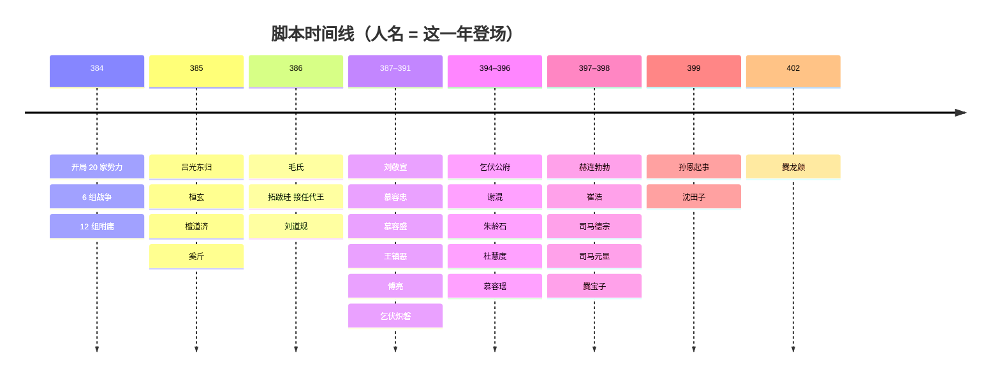

# 事件与时间线

> [← 返回展示页](../README.md)　·　相关：[势力](factions.md) · [疆域](territory.md) · [人物](characters.md)

三国全战一年 5 个回合，所以第 1 回合 = 384 年夏，第 6 回合 = 385 年，第 76 回合 = 399 年。下面是 Mod **脚本里写定**的事；其余的天下大势由你和 AI 自己打出来。

## 第 1 回合：把世界改成 384 年

新开局、玩家第 1 回合开始的一瞬间，脚本依次做这些事：

1. **唤醒势力**：八王之乱里多数派系开局是“休眠”的，送它一座城就会活过来；384 年的 20 家开局势力由此就位。
2. **换人**：291 年的旧人（司马家的王爷们）全部退场，170 位 384 年的历史人物登场，君主、储君各就其位；代国由刘库仁摄政。
3. **逐城重分地盘**：两百多座城按史实换主，见 [territory.md](territory.md)。
4. **带兵出场**：每家的君主和大将带着自己的部曲出现在都城，三员将领一军。
5. **封官**：各家按等级把丞相和五个尚书位封出去，不至于满朝都是“渴求高位”的人。
6. **成婚**：史实上的夫妻开局即成婚（见下）。
7. **外交**：12 组附庸、6 组战争（见 [factions.md](factions.md)）。
8. **天子**：八王之乱的“天子”令牌交还建康的晋室；原版的贾后、八王剧情全部摘掉。
9. **派系特色与军资**：各家挂上自己的特色和共有的「乱世军制」「就食于敌」，发开局军资，亏空另补。
10. **开局抉择**：原版开局的四选一抉择保留，文字改写成「淝水之后，何去何从」——缮治城池、整训部伍、充实府库，还是先发制人。

## 时间线

| 回合 | 年份 | 事件 |
|---:|---|---|
| 1 | 384 夏 | 世界布置完毕：6 组战争、12 组附庸、3 对夫妻成婚、各家封官；「群雄思奋」「就食于敌」开始计时 |
| 6 | 385 | **吕光东归**：凉·吕氏带着吕光、吕纂、杜进、姜飞、鸠摩罗什等 8 人和 4 支部曲出现在武威郡的休屠，立即与秦·凉州开战 登场：**桓玄**（灵宝）、**檀道济**（万里长城）、**奚斤** |
| 10 | 385 | 燕的「旬日之间，众至二十万」（维持费 −30%）到期 |
| 11 | 386 | 登场：**毛氏**（壮勇善骑射）、**拓跋珪**（代北之主）、**刘道规** |
| 16 | 387 | 登场：**刘敬宣** |
| 21 | 388 | 登场：**慕容忠** |
| 25 | 388 | 「就食于敌」（维持费 −20%）和「群雄思奋」（满意度 +20）到期——此后要靠打下来的地盘养兵、拿官爵安抚功臣 |
| 26 | 389 | 登场：**慕容盛**、**王镇恶**（王猛之孙） |
| 31 | 390 | 登场：**傅亮** |
| 36 | 391 | 登场：**乞伏炽磐** |
| 51 | 394 | 登场：**乞伏公府**、**谢混**（风华江左第一） |
| 56 | 395 | 登场：**朱龄石**（平蜀）、**杜慧度**（布衣蔬食） |
| 61 | 396 | 登场：**慕容瑶** |
| 66 | 397 | 登场：**赫连勃勃**（统万之主）、**崔浩**（算无遗策） |
| 71 | 398 | 登场：**司马德宗**、**司马元显**（西录）；**爨宝子**（建宁太守） |
| 76 | 399 | **孙恩起事**：休眠的“会稽豪强”在临海醒来，孙恩（首领）、卢循、徐道覆随这一家一起出现——384～398 年地图上没有他们，也不在晋的府署里；三人带“流寇”军制的部曲，立刻向晋、晋·北府、晋·荆州桓氏宣战 登场：**沈田子** |
| 91 | 402 | 登场：**爨龙颜**（南中大姓） |

## 到岁数才登场的人

384 年还不满 16 岁（或史实上更晚才出场）的人，到年份才在史实上的本家登场，一律从 1 级练起（拓跋珪 2 级）。本家已经灭亡的，按“投奔”顺序改投别家；都不在了就不登场。

| 年份 | 回合 | 人物 | 外号 | 登场于 | 本家亡了投谁 | 备注 |
|---|---:|---|---|---|---|---|
| 385 | 6 | **桓玄** | 灵宝 | 晋·荆州桓氏 | 晋 | 桓温幼子，日后的楚帝 |
| 385 | 6 | **檀道济** | 万里长城 | 晋·北府 | — | 日后刘宋的“万里长城” |
| 385 | 6 | **奚斤** |  | 代 | — |  |
| 386 | 11 | **毛氏** | 壮勇善骑射 | 秦 | — | 苻登之妻，登场时与苻登成婚 |
| 386 | 11 | **拓跋珪** | 代北之主 | 代 | — | 登场即接任代王（史实：386 年正月即代王位） |
| 386 | 11 | **刘道规** |  | 晋·北府 | — | 刘裕之弟 |
| 387 | 16 | **刘敬宣** |  | 晋·北府 | — | 刘牢之之子 |
| 388 | 21 | **慕容忠** |  | 西燕 | 燕 | 慕容泓之子 |
| 389 | 26 | **慕容盛** |  | 燕 | 西燕 | 慕容宝之子 |
| 389 | 26 | **王镇恶** | 王猛之孙 | 秦 | 晋·北府、晋 | 王猛之孙；史实上随叔父南奔，后为刘裕大将 |
| 390 | 31 | **傅亮** |  | 晋·北府 | — |  |
| 391 | 36 | **乞伏炽磐** |  | 乞伏 | — | 乞伏乾归长子 |
| 394 | 51 | **乞伏公府** |  | 乞伏 | — | 乞伏国仁之子 |
| 394 | 51 | **谢混** | 风华江左第一 | 晋 | — | 谢琰之子 |
| 395 | 56 | **朱龄石** | 平蜀 | 晋·北府 | — |  |
| 395 | 56 | **杜慧度** | 布衣蔬食 | 晋·岭南 | 晋 | 杜瑗之子 |
| 396 | 61 | **慕容瑶** |  | 西燕 | 燕 | 慕容冲之子 |
| 397 | 66 | **赫连勃勃** | 统万之主 | 铁弗 | 后秦、代 | 史实：391 年铁弗亡，奔后秦，407 年建夏 |
| 397 | 66 | **崔浩** | 算无遗策 | 燕 | 代 | 崔宏之子；史实上父子入魏 |
| 398 | 71 | **司马德宗** |  | 晋 | — | 孝武帝长子，日后的晋安帝 |
| 398 | 71 | **司马元显** | 西录 | 晋 | — | 司马道子世子 |
| 398 | 71 | **爨宝子** | 建宁太守 | 晋·宁州 | 晋 | 《爨宝子碑》的碑主 |
| 399 | 76 | **沈田子** |  | 晋·北府 | — |  |
| 402 | 91 | **爨龙颜** | 南中大姓 | 晋·宁州 | 晋 | 《爨龙颜碑》的碑主，刘宋时为宁州刺史 |

## 开局成婚的夫妻

游戏脚本没有“让两个人结婚”的接口，Mod 给每对夫妻做了一个只由脚本触发的成婚事件。毛氏 386 年才登场，她和苻登的婚事等她登场时再办（那时苻登若已另有配偶，就不拆）。

- **慕容垂与段元妃**：段氏，字元妃，右光禄大夫段仪之女。少而婉慧，有志操，尝谓其妹季妃曰：“我终不作凡人妻。”垂闻其贤，纳为继室。后垂称帝，立为皇后；尝谏垂以太子宝不堪大任，垂不能用。
- **苻坚与张夫人**：张氏，苻坚之妾，明辩有才识。坚将伐晋，群臣切谏不从，张氏引《书》《诗》以谏：“天地之生万物，圣王之驭天下，莫不顺其性而畅之。”坚曰：“军旅之事，非妇人所当预也。”
- **王凝之与谢道韫**：谢道韫，安西将军谢奕之女，聪识有才辩。叔父安尝内集，俄而雪骤，道韫咏曰：“未若柳絮因风起。”初适王羲之子凝之，还，甚不乐，曰：“一门叔父则有阿大、中郎，群从兄弟复有封胡羯末，不意天壤之中乃有王郎！”
- **苻登与毛氏**：毛氏，河州刺史毛兴之女，壮勇善骑射。登为姚苌所袭，营垒既陷，毛氏犹弯弓跨马，率壮士数百人与苌交战，杀伤甚众。众寡不敌，为苌所执，骂曰：“姚苌无道，前害天子，今辱皇后，皇天后土，宁不鉴照！”

## 史实对照（不是脚本事件）

下面是史实上这些年发生的事，给想“照着历史打”或者“偏不照着打”的玩家参考。游戏里它们不会自动发生。

| 年份 | 史实 |
|---|---|
| 383 | 十一月，淝水之战，秦军溃败 |
| 384 | 正月慕容垂称燕王、围邺；三、四月慕容泓、慕容冲起兵，姚苌称万年秦王；六月慕容泓被杀，慕容冲继立；八月谢玄北伐；十月苻朗以青州降晋、刘库仁遇害 |
| 385 | 慕容冲称帝于阿房；八月苻坚被姚苌缢杀于新平，苻丕即位于晋阳，谢安卒；九月吕光入姑臧，乞伏国仁自称大单于 |
| 386 | 正月拓跋珪即代王位（四月改称魏王），慕容垂称帝、定都中山；慕容冲被杀，西燕东迁，慕容永据长子；姚苌入长安称帝；苻丕败死，苻登即位 |
| 388 | 谢玄卒；乞伏国仁卒，弟乾归继立 |
| 391 | 拓跋珪破铁弗，刘卫辰死，少子勃勃出奔 |
| 394 | 姚兴破杀苻登，前秦亡；慕容垂灭西燕 |
| 395 | 参合陂之战，魏大破燕军 |
| 396 | 慕容垂卒；晋孝武帝暴崩，安帝立，司马道子专政 |
| 397 | 魏克中山，后燕分裂；秃发乌孤建南凉，段业、沮渠蒙逊建北凉 |
| 398 | 慕容德建南燕；拓跋珪称帝、迁都平城；王恭、殷仲堪、桓玄起兵 |
| 399 | 十月孙恩起事，三吴八郡响应，王凝之遇害；法显西行求法 |
| 402 | 桓玄入建康，杀司马元显；孙恩败死，卢循继之；柴壁之战，魏破后秦 |
| 403 | 十二月桓玄篡晋称楚；后凉亡 |
| 404 | 二月刘裕京口起兵，桓玄败死 |
| 407 | 赫连勃勃建夏；冯跋拥高云代后燕 |
| 410 | 刘裕灭南燕，回师破卢循、徐道覆 |
| 417 | 刘裕北伐灭后秦，王镇恶先入长安 |
| 420 | 刘裕代晋，国号宋 |
