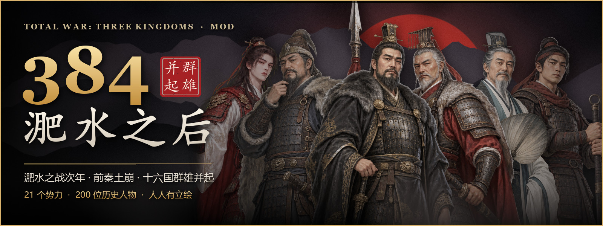

# 全战三国 · Total War: THREE KINGDOMS

> [← 返回合集首页](../README.md)

| Mod | 简介 | 状态 |
|---|---|---|
| [**384 · 淝水之后**](384/README.md) | 十六国剧本：公元 384 年，淝水之战次年。22 个势力（20 家可选）、204 位历史人物、逐城按史实划分的疆域，做在「八王之乱」战役上，190 年的三国不受影响；不依赖其他 Mod | ✅ 已发布：[Steam 创意工坊](https://steamcommunity.com/sharedfiles/filedetails/?id=3808594996)（0.11.0） |

---

玩家自制的非商业 Mod，与 Creative Assembly、SEGA 没有任何关联。
